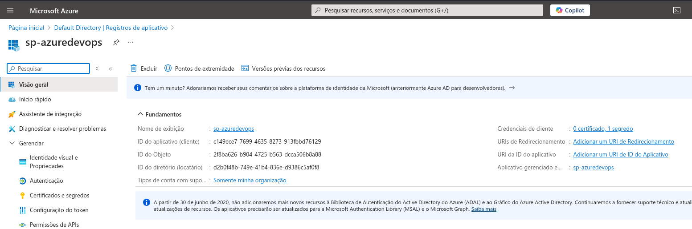
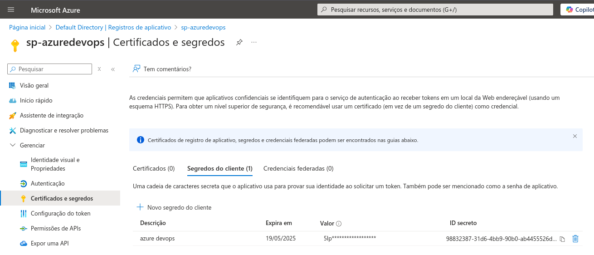
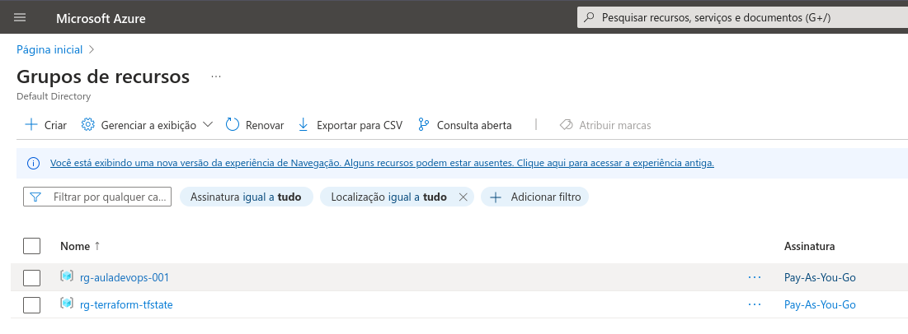
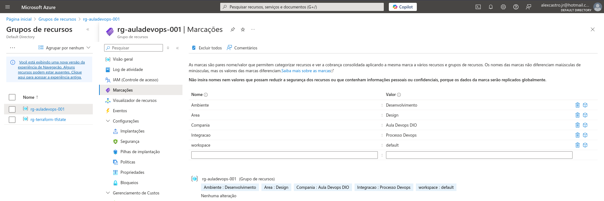
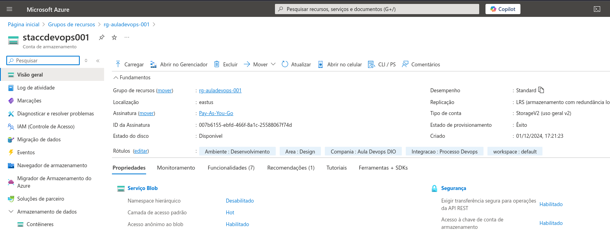
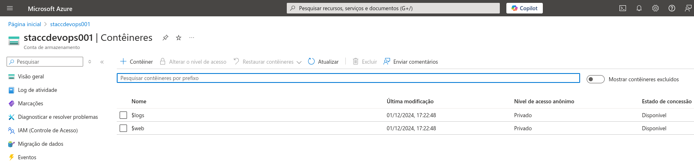
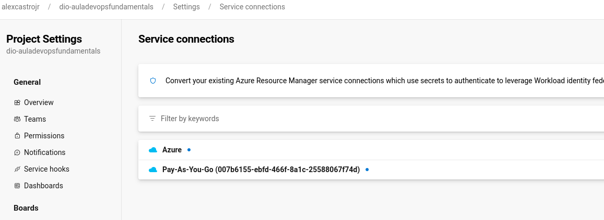
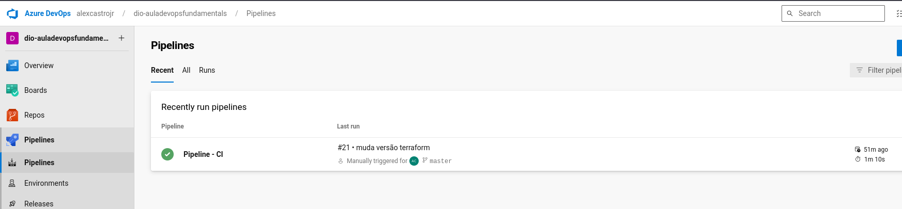
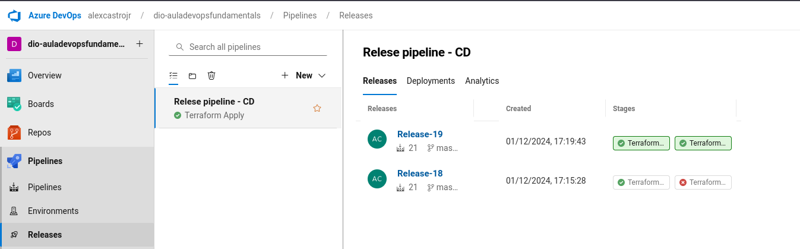

# Projetos do curso Aula Devops Fundamentals

codigoTerraform: recurso Terraform para a criação no Azure

website: site html para ser utilizado como teste no Git

## Resolução

Projeto no Azure DevOps: <https://dev.azure.com/alexcastrojr/_git/dio-auladevopsfundamentals>

- [x] Criar conta na azure
- [x] Criar conta Azure Devops
- [x] Criar e evidenciar  Service Principal

  - [x]  - Criar e evidenciar secret
  
- [x] Criar e evidenciar resource group criado

  - [x]  - Criar e evidenciar tags do RG
  
- [x] Criar e evidenciar storage account

  - [x]  - Criar e evidenciar um container na SA
  
- [x] Criar e evidenciar o Service Connections do Azure Devops e a conta Azure

- [x] criar e evidenciar pipelines de criação

